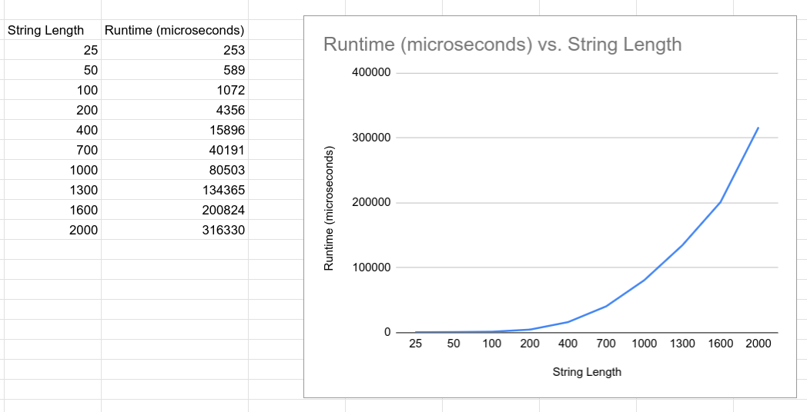

# GreedyAlgos

Name: Kaitlyn Tran  
UFID: 79518935  

Name: May Macler  
UFID: 26170596  

## Files
`src/main.cpp`: The source code for algorithms  


## Compiling
To compile the matcher, use a C++ compiler (like g++):  
```
g++ -std=c++11 -o test ./src/main.cpp
```
To test with input, run:  
```
./test ./input/example.in
```
Your output should match what is written in example.out
  
### Timing
To time the results, also pass `time` after the input file name:  
```
./test ./input/5_100.in time
```
This will the runtime (in microseconds, averaged across 10 runs), followed by the normal output.

## Assumptions
The program needs O(nm) space to store the long long DP table. 
Input strings should only contain characters defined in the initial K alphabet lines.

## Questions
### 1. Empirical Comparison

